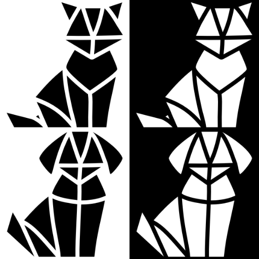

# vjot

Consider the following scenario: You, a seasoned veterinarian, keep a veterinary practice in the outskirts of a small town somewhere in Europe. This is neither a clinic nor a hospital: neither reception service, nor secretaries or assistants are available, just you and two more practitioners. For every appointment scheduled, you get to retrieve the medical history of the patient, perform the medical tasks at hand and handle the communication with the patient’s guardians. At the end of the day, you get to inform the rest of the team about the medical progress of the patients you took care of, so that every veterinarian, including you, know everything there is to know about each and every case. You understand well that exchanging opinions and updating a common medical log is good practice, with the added benefit of keeping everyone on the loop, ready to take on any patient of the buisness's clientele. Even though this strategy performed adequately so far, it gets less and less viable as cases pile up. Keep in mind that work is absolutely hectic, with no time usually available between the arranged appointments to put together or update any kind of formal log. Furthermore, emergency cases are not uncommon, disturbing the flow of attending to the anticipated ones. There is more and more for you to remember, details, observations, and thoughts, that must be somehow communicated to the other practitioners. You write down notes everywhere you can, on empty drug packages, spent consumables, scraps of paper, on anything you find available at the moment, inside and outside of your worn apron's pockets. If only there was an app that could help you with that:

<br>

## a Veterinarian's Jotter

<br>

<br>

> jotter /ˈdʒɒtə/ NOUN. A jotter is a small book for writing notes in. American English: notebook /ˈnoʊtbʊk/

**vjot** is a simple app, a veterinarian's jotter. Veterinarians create records between cases and retrieve them at any time. The point is to collect short notes on the last patient's medical progress, so it's then easier for the practitioners to communicate their therapeutic approach with the rest of the team, later that evening. Each record can hold the practitioner's thoughts or any number of relevant information, utilizing attached photos, written text and/or audio recordings - the point being that literally seconds is all that it takes for one to update such record. There's no need for formallity; just a handful of notes, a couple of reminders, a few scattered details, anything that should not be forgotten until orderly logged. In addition, incurred expenses related to the case can also be designated, the total amount of which gets calculated and subsequently presented to the user - allowing him/her to provide immediate updates to both the patients' guardians and his/her collegues. Finally, an optional description, access to patient profiles and an indication of emergency are all available for association with the occurring incident.

<br>

<br>

**vjot** also acts as a frontend client that consumes entirely both [The Cat API](https://www.thecatapi.com) and [The Dog API](https://www.thecatapi.com) services, providing an escape from everyday stress in the seldom cases of downtime or after the veterinarian's working hours. Exploiting the full functionality supplied by these APIs, one can browse cats' and dogs' breeds and learn more on them, search for cat or dog images (including their classification provided by a pattern recognition vendor) applying filtered parameters, fav and upvote/downvote any of them, download and store them at his/her Photos Library, upload his/her own, and later delete the ones uploaded.

[](https://youtu.be/cxO0lCeWlOw)
[](https://youtu.be/k74aXo58SiU)
[](https://youtu.be/gZOrZ3DmCno)

### JOTTING FEATURES

**vjot**'s main functionality and the motive behind its development is implementing a lightweight, loosely structured jotter for veterinarians. It's more or less a fact of life, that medical professionals commonly work in high stress environments, having limited mental capacity for conforming to strict UI requirements under pressure - and for good reason. The app doesn't utilize fancy welcome screens or complicated onboarding processes and that's by design, as it aspires to be as straightforward, immediate and utilitarian as possible. Bellow, some of the available jotting features are described in more detail.

<br>

<br>

***...about users:***

Users are subtly encouraged through symbology and gracefully limited functionality to create an account and activate their session each time they use the app. The app is meant to be used on devices shared between practitioners; jotter instances are cooperative, for containing details that are meant to be shared. There's no need for securing user accounts from being accessed by other onboarded users - on the contrary. Therefore no passwords or keyphrases are implemented or required. In any case: 

<br>

- Users are able to create accounts, providing personal information such as contact details. Creating an account ("onboarding") is not necessary but for doing so, extra functionality is enabled, especially related to options for consuming the APIs. More on that later.
- Users are presented on a searchable list, which also provides the option to delete ("relieve") collegues.
- The details' view of each account implements an image picker that any user can utilize to set an image for his/her profile, changing it later on will, if desired. 
- The details' view present the optional address information of the user if provided. In such case, Map application can be launched from within the view, quering his/her residence location.
- The details' view present the optional contact information of the user, if provided, including his/her email address and his/her telephone number. In such case, Mail or the Phone applications can be launched from withing the view, for sending a mail and initiating a call with the user respectively.
- Form views enable the user to either onboard or update his/her profile. The only requirement for onboarding is providing a name, a handle, some way fot the user to be addressed, even one character long. Forms are modified to include every previous detail provided, making them visible in place of the relevant text field prompts, thought the user can of course edit them at any time.
- Like any view that presents an image, the app utilizes the said image to generate the background wallpaper of the view. Its brightness is dynamic, with its brightness changed when toggling between light and dark color scheme modes; that way it is ensured that the text displayed will always be easily readable. The same goes for both the user section view and the one including the above mentioned details.
- If no users have onboarded, or no user has activated his/her session (a strange state for the app to be in as the only way for one to achieve this is to delete the current user), respective symbology is used to communicate the fact. Again, with no current user, functionality is gracefully limited throught the app.
- When updating their details, users are presented with a list of the pending medical incidents for them to take on, accepting responsibility and giving substance to the search/filtering function that is used when listing the incidents. More on that later.
- On the bottom of the user section view, short instructions are available on how the swipe actions provided by the list function. They get accented if no veterinarian's session is selected as current, to motivate the users to activate their session for using the app effectively.

<br>

***...about patients:***


In the app's context, patients are of course companion animals. A listing of their records is provided, with the ability to edit their details in any time. Creating animal records, provides users with the ability to associate specific patients with specific medical incidents, utilizing pickers in both the jotter and the incident section views. There's no such obligation though. Also, it is kindly noted that the companion animal records are actually based to the European passport's for companion animals specifications; a lot of fields are therefore available for the practitioners to fill, if they need to do so. Specifically:

<br>

- Users can create, update or delete ("arrange") patient records at any time. The existing records are shown in a searchable list. As the naming of the companion animals is optional (it's not uncommon to deal with stray patients brought by people that are not their permanent guardians), searching is performed by utilizing their alphanumeric identification. In addition, if no name is provided, the last 12 digits are shown in the listing instead. 
- Creating or updating patients, navigates users to an extensive form, with fields and instructions found on the official specifications for the standard companion animal's European passport. Every field is optional, as an alphanumeric identification is created automatically to differentiate each patient. The app utilizes an image picker for allowing the association of a specific image with a patient; date pickers for entering dates such as birthdates or treatment and vaccination dates; and a color picker for designating visually the color of the animal's fur (although the usefulness of the color picker is debatable). As with the user's onboarding or updating views, the form displays already provided information as prompt entries for the respective text fields. 
- Contrary to the users' section, for viewing the details of an existing record, the updating form is again utilized; no distinction therefore exists UX-wise, between just viewing or actually editing the patient's information. It's the extensive amount of details stored for each record that called for such design.  
- The list view background is again generated based on the image of the patient selected, if any. Not selecting any patient as current, doesn't affect the app functionality at this app's version - although more actions regarding companion animals will be added in the future. In any case, respective symbology is used to communicate either when no patient record is available, of no patient selected as current. The current patient is displayed on the bottom of the view by name or alphanumeric identification. 
- Again on the bottom of a view, short instructions on the swipe action provided by the list are also included. They get accented if no patient is selected as current, to motivate the users to select one. 

<br>

***...about incidents:***

When launching the app, the user immediately gets to the jotter view, displaying the last occurring incident dealt at the practice. No welcome screen is utilized. The jotter preview provides the following functionality:

<br>

- User can provide a short description of the incident, optionally. A checkmark button next to the text field allow for the keyboard to be dismissed when he/she finishes typing the description.
- User can pick images from his/her photo library and attach them to the incident, associating them with it. He/She can tap on any of them to see it in full size. He/She can also delete any of them, using the x-mark icon found above their upper right corner.
- User can record audio for things thay need to remember but no time is available for typing them. Each record can be played at any time. Each record can also be marked for deleteion. Records are not immediately deleted, in case the practitioners regret their choise. Even marked for deletion, the record can still be played, as long as the jotter view remains active. 
- User can write down notes and optionally associate a specific cost to each one of them. The cost representation takes the form of euro currency, utilizing the format specified from the current user's locale. A numeric keyboard is presented for entering the said cost. 
-  As stated earlier for other cases, the background is generated dynamically when at least one image is attached to the incident record. Also, the users tap the relevant toggle found on the bottom of the view, designating the case as an emergency. In such case, the background changes to a deep red when using the dark mode color scheme, or to a bright yellow when using the light mode color scheme. As the device running the app is meant to easily visible throught the practice's premises, changing the background to this prominent state, indicates to colleagues that the occurring case is special.  
- For every incident, a patient can be selected and associated with it. If no patient records are available, the fact is communicated to the users utilizing the appropriate symbology. 

<br>

Except for the jotter view, which acts as a form for both creating and updating incidents, the user has also access to an incident section, in which a listing of already generated incident records is presented.

<br>

- Every incident on the incidents' list is represented by its creation date. If provided, its short description is also displayed, along with the total due cost, as calculated by the user's earlier estimations. 
- The list can be filtered either by date, or by practitioner responsible (filters can be combined with each other).
- Every incident can be deleted ("settled").
- Any incident can be selected as occurring, so that the app, when launched, displays this particular incident at the starting jotter view. By default, the last created incident is designated as the occurring one. The incident designated as occuring is also displayed by creation date at the bottom of the view. When no incident is selected (by deleting the occurring one), special symbology is utilized for communicating the fact to the users. In this state, the starting jotter view is consequently empty. 
- If the incident is declared as emergency, a distinct red exclamation mark is used to indicate the fact, both in the incidents' listing and in the users' details' form view, when presenting the incidents as pending for him/her to take responsibility for, as described earlier. 
- A new incident record can be created at any time, presenting the user with an empty jotter view. The newly created record will be automatically saved and designated as occuring when any information is provided for it.
- On the bottom of a view, short instructions are provided, describing the list's swipe actions' functionality. They get accented if no incident is selected as occuring, for motivating the users to select one. 

<br>

### API FEATURES

**vjot** acts as an full featured frontend client of both [The Cat API](https://www.thecatapi.com) and [The Dog API](https://www.thecatapi.com) services, consuming them entirely. The functionality provided to the user is divided into 3 sections:

<br>

<br>

***...on images:***

User is able to search for, find, upload, fav, vote for, and delete images of cats and dogs, utilizing the relevant API according to species. A number of associated details is provided for each of those images along with a unified set of actions described in the following points.

<br>

- User can search for images of cats or dogs. The search can be filtered by breed, category, type, size and the inclusion or not of companion animals without a specified breed. Both breeds and categories are fetched by the APIs. Any number of images can be served simultaneously, bounded by a hard limit imposed, according to the service's subscription tier.
- User can find specific images, quering their unique alphanumeric identifier. This process can also be customized by requiring a response with a specific image size. 
- User can fav or un-fav any image searched or found. The app will store and therefore remember each user's fav and will update the relevant views faved images accordingly. The app provides the ability for the user to view all his/her faved images, displaying along the said images, the time that the fav took place. Also, one can choose to browse other users' favs as well, past or present. A temporary view is presented as these lists are getting generated and processed. A spesific fav can be queried, using its unique numeric identifier, displaying all the available information associated with the said fav.
- The same goes with votes; user can upvote or downvote any image searched or found. Every vote is characterised by a selectable numeric value, with a lower boound of -127 and an upper bound of 128. User can vote again at any time, updating the value that has beem associated with the image voted, or delete the vote entirely. The app will remember each user's vote and update the relevant views of images voted for accordingly. The app provides the option for one to browse all the his/her votes, including the time when each particular vote took place and the value associated with it. The option to explore the votes of other users, past or present, is also provided. A temporary view is presented as these lists are getting generated and processed. A specific vote can be searched by its unique numeric identifier.
- User is able to download any image fetched by the API services, at any time, from any view. An encouragement message is presented for doing so, informing him/her that the image is then stored into his/her photo library.
- User is able to fetch a pattern recognition classification analysis for any image, at any time, from any view. The analysis includes the image's unique alphanumeric identifier, the vendor responsible for the said classification, the date this analysis took place, and every detected label (moderated or not) that relates to the specified image (along with their confidence level, parents and bounding boxes, if specified).
- User is able to upload an image of his/her own to the API service. For every such action, the app presents the status with which the relevant API responded with, the new alphanumeric identifier associated with the photo, if and when it was approved, a URL for accessing the photo, along with the responsible user's unique alphanumeric identifier. An animation is shown as the uploading takes place.
- User is able to fetch any number of the previously uploaded photos, by any user of the app, past or present. He/She will be presented with the images themselves, the date each image was uploaded and accepted by the relevant API service, the user responsible for the said upload and the image's original filename. He/She is also able to filter the quering process by these criteria.
- User is able to delete any photo he/she or any other user, past or present, uploaded to the relevant API. An confirmation dialog box informs him that this action cannot be undone, and the app communicates visually that the deletion commenced, by desaturating the deleted image.

<br>

<br>

***...on breeds:***

User is able to browse or search for cats' and dogs' breeds, either by name, or by trait and group. Depending on his/her network connection status, either a listing of reference images is provided for representing each breed or more spartanly, in case of loose connectivity, only the name of each breed. Choosing a breed, the user is provided by information about the chosen breed, fetched by the relevant API service and visualized in a unified way by the app. 

<br>

- User can learn about alternative names of breed, if available. Read a short description, if available. Learn about the breeds origin, either by a set of countries or country codes, which the app utilizes to show the specified in the Maps. User can learn about the breed group the breed belongs to and the reason for developing that breed, again, if such information is available. User can also learn about the range of weight, height and life span of the animals belonging to the breed. If available, user can discover the traits that shape the temperament associated with the breed, along with metrics and characteristics, if any of them is provided by the API service. Finally, he gets to be informed of the sources from which all this information was generated, and for good measure, the app also provides him/her with the unique alphanumeric identifier of the breed for future reference.
- User can choose to fetch more images of animals belonging to the chosen breed. The app provides a different modal for performing the fetching action, compared to other places at the app: this time, one can pull to refresh, retrieving a newly fetched image every time he/she does so. The full functionality that accompany each image is of course provided, faving, voting, downloading and getting the pattern recognition specification analysis if desired.

<br>

<br>

***...on data:***

User is able to fetch the list of sources provided by the utilized API service. The app enables this functionality for both APIs used but at this time, the feature is provided only by [The Cat API](https://www.thecatapi.com) and not [The Dog API](https://www.thecatapi.com). The version of the API services can also be obtained.

<br>

### THE CAPSTONE RUBRIC

1. The app has a README file that hopefully includes an adequate explanation of the app. Bellow, at least one example of every feature required by the capstone rubric will be identified and a specific file name will be provided.
2. The app has a splash screen. It was implemented "The SwiftUI Way" by utilizing the relevant key-value pairs provided in the custom iOS target properties. It includes an image set (the app icon) and a color set (the default system background color). Both the image set, and the color set are adjusted to differentiate their appearance when the user switches his/her system to either the light or the dark color scheme.
3. All features in the app are completed, and unfinished features are commented out.
4. Several lists and grids are included in the app. One can examine the users' list, found in the ```/capstone/Views/ClinicViews/VeterinarianViews/VeterinarianHomeView.swift``` file. Pressing on any list element navigates the user to a user's details' view. If the app is launched in development mode and subsequently bootstrapped, the already included content is extensive enough for the scroll feature to be demonstrated. The app utilizes a tab view as the root navigation source, containing five tabs.
5. The app performs an extensive set of network calls to both download and upload data, related to its core tasks. For example, on can examine the ```/capstone/Views/Models/APIModels/APIBreedModels/APIBreedFunctions.swift``` file, which includes the implementation of a network call for downloading data and the ```/capstone/Views/Models/APIModels/APIImageModels/APIImageFunctions.swift``` file, which includes the implementation of a network call for uploading data.
6. The app handles all typical errors related to network calls, including no network connection and server errors. One can examine the ```/capstone/Sins``` directory for a generic overview of the error handling functionality and the ```/capstone/Views/BreedViews/CatBreedViews/CatBreedsView.swift``` file for both an error throwing example and the way i which the process for alerting the user was implemented throughout the app. For some cases of reoccurring network errors, the app chooses not to flood the user with alerts, especially when a graceful fallback can instead be achieved - presenting, if able, a more spartan view of the information requested. The breeds' list is such an example: it's not uncommon for the 429 http error to occur, when too many requests are sent for any given time to one of the available API services (especially when said API services are operated in their free subscription tier). In the background, the app manages to save a copy of the breeds list and if such error occurs, or the user has no connectivity at all, then the list fallbacks to its stored instance. When this is the case, no reference images are displayed, but the breeds are still browsable by name. When navigating to a details' view, the user is eventually being informed of the network error, but not beforehand. This aversion of alerting the user is carefully adjusted to target only very specific erroring events and is implemented with great care for not denying the user the necessary awareness which he/she needs for not to be discouraged when the app behaves unexpectedly.
7. The app utilizes the filesystem storage as a source of truth for the state of every created entity. Let's discuss for example how the attached images for each incident are stored, a mechanism implemented in ```/capstone/Gigs/IncidentGig.swift``` and ```/capstone/Models/IncidentModel.swift``` files: the ```IncidentModel``` struct contains a ```Snap``` nested struct with an id of type UUID. This id acts as a pointer to an image, the data of which are stored in a file with a file name generated to include the said id. For every ```snap``` instance contained in an ```incident``` instance, the app looks the file bearing the name which matches the id serving as pointer, in order to reconstruct the object of type UIImage used by the Image View inside the Jotter View. UserDefaults are also utilized in ```/capstone/Setup/Bootstrapper.swift``` file, making use of the ```@AppStorage``` property wrapper.
8. The app communicates whenever data is missing or empty, the reason for that condition, and the step one can take in order to move forward. An example can be examined in the ```/capstone/FavViews/FavFallbackView.swift``` file, utilized by the ```/capstone/Views/ImageViews/CatImageViews/CatImageFavViews/CatImageFavView.swift``` file (along with other Views as well). It covers the case of a user attempting to navigate to his/her faved cat images listing when no such image has yet to be faved. Instead of presenting an empty listing, a fallback view is instead presented.
9. All included screens work successfully without crashes or UI issues. Special care is taken when switching between compact and regular vertical size classes, adjusting the aspect ratio of visual elements when required, especially in listings. An example can be examined in the ```/capstone/InfoViews/InfoSpeciesView.swift``` file. Special care is also taken when switching between light and dark color schemes, especially in adjusting the brightness of the generated backgrounds. An example can be examined in the ```/capstone/ClinicViews/PatientViews/PatientHomeView.swift``` file. There was at least one obvious UI issue identified, the inadequate spacing between the elements of the jotter audio recordings list implemented in the ```/capstone/JotterViews/JotterView.swift``` file that is partially dealt with and is scheduled to be addressed in depth. Functionality is not affected. 
10. It is an on-going ambition for the code to be organized and easily readable. Project source files are organized in folders such as Views and Models (and Sins, Jewels, Consts, Data, Finance, Tools, UIUX, Compass, Setup, Gigs, Engines and Blocks). The project does utilize SwiftLint, but the majority of the rules were disabled. The advice provided by a subset of the default rules, like the dreaded cyclomatic complexity one, were taken into consideration and addressed where able and possible. Others, like the trailing newline one were consciously disabled, even with the autocorrection option available: for instance, when an if-statement was implemented, it seemed useful for a newline to be included in code, preceding the optional else clause with an easily visible, clearly distinguishable stylized comment that explained the reasoning for the implementation of the said clause - SwiftLint didn't allow such code formatting without the heavy use of exemptions or equally extensive customization. At least some consistency was achieved, more of less, even though the conventions followed are certainly not formal. Project does build without Warnings or Errors.
11. The code has both UI and unit testing with a code coverage of 62.9% for 108701 executable lines accessed in tests. All test cases pass.
12. The app includes a custom icon and a custom display name. Styled text properties and animations are also included, as implemented for example in the ```/capstone/Views/ClinicViews/AboutViews/AboutView.swift``` and ```/capstone/Views/ImageViews/DogImageViews/DogImageUploadViews/DogImageUploadView.swift``` files respectively. The app does not include an onboarding screen when it's launched, although one is provided when users choose to optionally create their accounts. This was deliberate and by design, as the app aspires to be utilitarian, used commonly under pressure.


<br>

### VOICEOVERS

[](https://youtu.be/TYFs4HaGw3s)
[](https://youtu.be/UQEGdpiK1j4)

## BOOTSTRAPPING PROCESS

For the needs of the bootcamp, the app is set to development mode. Production mode can easily be enabled by setting the debug variable in the ```/capstone/CapstoneView.swift``` file to false. In the present mode, 3 options are available at launch:

<br>

1. ***Launch***: Launch option launches the application normally.
2. ***Wipe***: Wipe option wipes clean the app's ```Documents``` filesystem directory. When followed by selecting the launch option, the user gets to experience the app in a clean slate environment, like the app was just installed to his/her system, without any content pre-existing in storage.
3. ***Bootstrap***: Bootstrap option sets the app in a used state. Such state enables the user to discover the functionality of the app without having to create content from scratch. ***It is also the option utilized by the UI testing suite.*** The implementation of the bootstrapping process can be examined in the ```/capstone/Setup/Bootstrapper.swift``` and ```/capstone/CapstoneView.swift``` files. Selecting to bootstrap the app, a two-fold procedure commences:

<br>   

- Assets (images and audio recordings) are being downloaded from a certain dedicated internet domain. They are stored in the app's ```Documents``` filesystem directory. If the bootstrap option is selected again when relaunching the app, and the said assets are detected in storage, the said downloading step is skipped, saving both time and bandwidth.
- A set of mock entities is instantiated utilizing the downloaded assets, veterinarians, medical incidents and patients. The user can act upon the mock entities normally, editing or deleting them while using the app. When relaunching, if the bootstrap option is selected again, the mock entities are restored to their original state. 

<br>    

One can simply launch the app, selecting the ***Launch*** option and use it normally. One can also ***Wipe*** + ***Launch*** for getting a clean-slate experience without having to reinstall the app. Or, he/she can ***Wipe*** + ***Bootstrap*** for a consistent development environment with certain predictable and testable content having already been generated and included. Or finally, he/she can just ***Bootstrap*** the app, for restoring the aforementioned content to its original state.

<br>

### SOURCES

[The Cat API](https://www.thecatapi.com) and [The Dog API](https://www.thecatapi.com) services are generously provided by [That API Conpany](https://www.thatapicompany.com).

<br>

<br>

The vector icons used originate to artists hosting their artwork at [The Noun Project](https://thenounproject.com/) under a Free Creative Commons license. A NounPro Unlimited Individual Subscription was purchased to support their work.

<br>

<br>

The photos used for the mock instantiated  entities, for testing and for demonstrating the app, originate to artists hosting their artwork at [Unsplash](https://unsplash.com/) under a Free Creative Commons license.

<br>

<br>


<br>
<br>
<br>
<br>
<br>

Special thanks to Bob DeLaurentis and Mina Gerges.